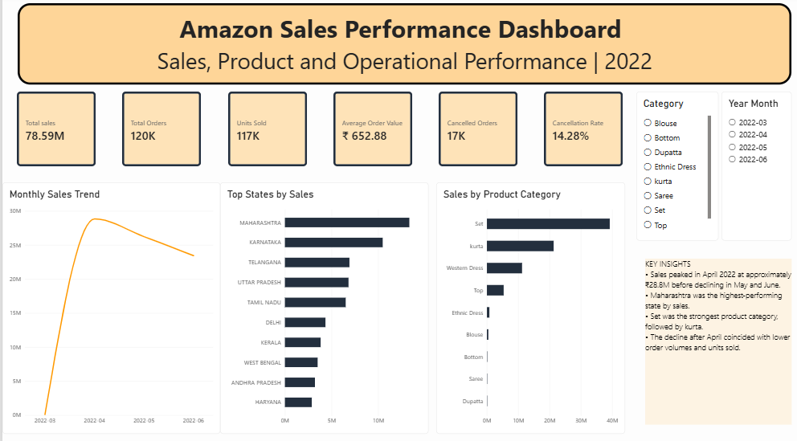
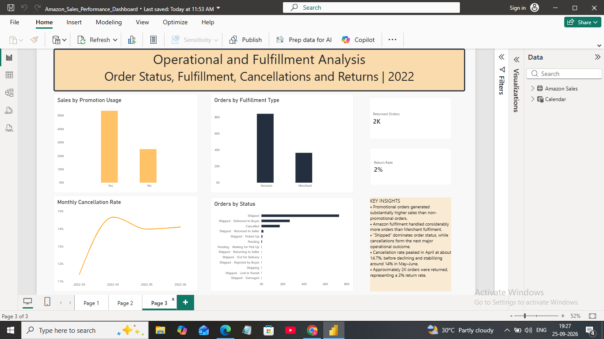

# Amazon Sales Performance Analysis | Power BI
## Project Overview
This project presents an interactive Power BI dashboard developed to analyze Amazon sales performance across sales trends, product categories, SKUs, geographical regions, order fulfilment, cancellations, promotions, and returns.
The objective of the project was to transform raw sales data into a structured business dashboard that enables users to identify key performance trends and support data-driven decision-making.

## Dashboard Preview
### Executive Sales Overview

### Product Performance Analysis

### Operational & Fulfilment Analysis

## Business Questions
The analysis was designed to answer questions such as:
- How are sales performing over time?
- Which states generate the highest sales?
- Which product categories contribute the most revenue?
- Which SKUs and product sizes perform best?
- How are monthly sales changing compared with the previous month?
- What impact does promotion usage have on sales?
- How do Amazon and Merchant fulfilment compare?
- What are the cancellation and return patterns?
- 
## Dashboard Structure
### 1. Executive Sales Overview
Provides a high-level view of overall business performance using KPIs and sales trends.
Key metrics include:
- Total Sales
- Total Orders
- Units Sold
- Average Order Value
- Cancelled Orders
- Cancellation Rate
- Monthly Sales Trend
- Sales by State
- Sales by Product Category

### 2. Product Performance Analysis
Analyzes product-level performance across categories, SKUs and sizes.
Key analysis includes:
- Category Sales Trend
- Top 10 SKUs by Sales
- Units Sold by Size
- Month-over-Month Sales Growth
- Product category comparison

### 3. Operational & Fulfilment Analysis
Focuses on order operations and fulfilment performance.
Key analysis includes:
- Sales by Promotion Usage
- Orders by Fulfilment Type
- Orders by Status
- Monthly Cancellation Rate
- Returned Orders
- Return Rate

## Key Insights
- Total sales reached approximately **₹78.59M** from around **120K orders** and **117K units sold**.
- Sales increased sharply in April 2022 before declining during May and June.
- **Maharashtra** was the highest-performing state by sales.
- **Set** was the strongest revenue-generating product category, followed by Kurta.
- Medium and Large sizes were among the highest-demand product sizes.
- Amazon fulfilment handled considerably more orders than Merchant fulfilment.
- Promotional orders generated substantially higher sales than non-promotional orders.
- The cancellation rate peaked at approximately **14.7%** before stabilising around 14% in May–June.
- Approximately **2K orders were returned**, representing a return rate of around **2%**.

## Tools & Technologies
- **Power BI** – Dashboard development and data visualization
- **Power Query** – Data cleaning and transformation
- **DAX** – KPI and analytical measure creation
- **Data Modeling** – Calendar table and model relationships
- **GitHub** – Project documentation and portfolio presentation

## DAX Measures
Custom measures were created for business analysis, including:
- Total Sales
- Total Orders
- Units Sold
- Average Order Value
- Cancelled Orders
- Cancellation Rate
- Returned Orders
- Return Rate
- Previous Month Sales
- Month-over-Month Sales Growth

## Skills Demonstrated
`Power BI` `Power Query` `DAX` `Data Cleaning` `Data Modeling` `Data Visualization` `Business Intelligence` `KPI Analysis` `Sales Analysis` `Dashboard Design`

## Project File
The complete Power BI dashboard is available in this repository:
`Amazon_Sales_Performance_Dashboard.pbix`
The file can be downloaded and opened using Microsoft Power BI Desktop.

## About Me
I am a Biotechnology postgraduate transitioning into Data Analytics, with experience working with research and experimental data. I am developing practical analytics projects using Power BI, SQL, Python and Excel to apply data analysis techniques to real-world business problems.
I am currently seeking entry-level opportunities in Data Analytics and Business Analytics.**
